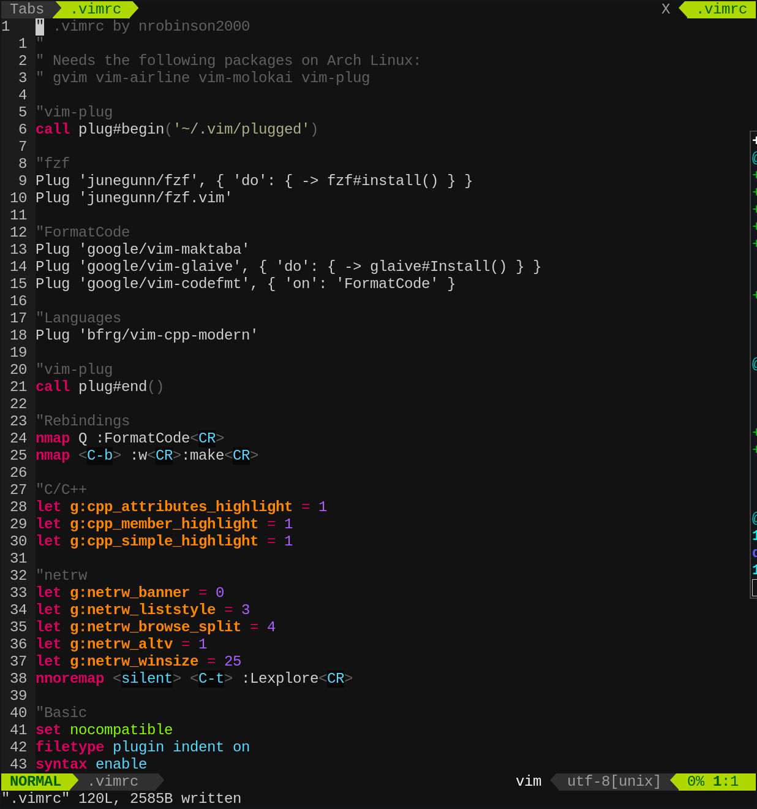

# dotfiles

My attempt at publishing my dotfiles without it becoming distro-specific
like the following repositories:

- [nrobinson2000/pi400-base](https://github.com/nrobinson2000/pi400-base)
- [nrobinson2000/arch-base](https://github.com/nrobinson2000/arch-base)
- [nrobinson2000/manjaro-base](https://github.com/nrobinson2000/manjaro-base)
- [nrobinson2000/linux-blade](https://github.com/nrobinson2000/linux-blade)

# Featured files

- `.bash_aliases` - Bash configuration (prompt, aliases, etc.) 
- `.vimrc` - Vim configuration (Settings/Plugins) *Requires [vim-plug](https://github.com/junegunn/vim-plug) and [Powerline](https://github.com/powerline/powerline)*

